# Directory for Fall 2023 TA Examples

## The link in the description of the YouTube video should be a "Raw" GitHub link. 

As long as your file's name doesn't change, the raw link to your code file will provide users with the most up-to-date version of your code (if it's on GitHub.) Therefore, you can make changes after your video has been released without changing the link in the video description. 

## To obtain a raw link, follow these steps:

I'll use mine from Spring 2023 as an example, but you'll navigate to the Fall 2023 projects.

1. **Fork The Art of Making's CPB Repository**
This will create a copy repository under your account that you can edit. You'll eventually request these edits to be added back into The Art of Making's official repository.

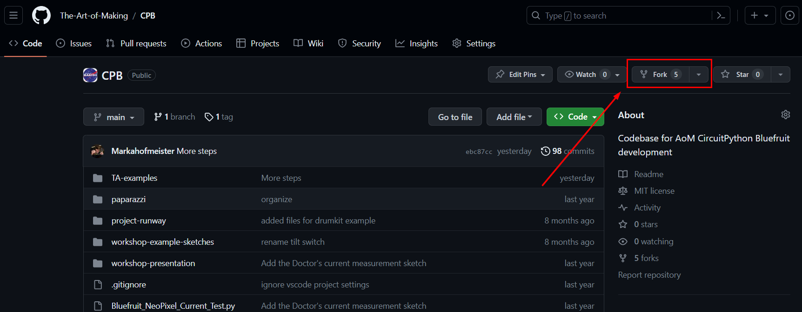

Then, click "Create Fork."

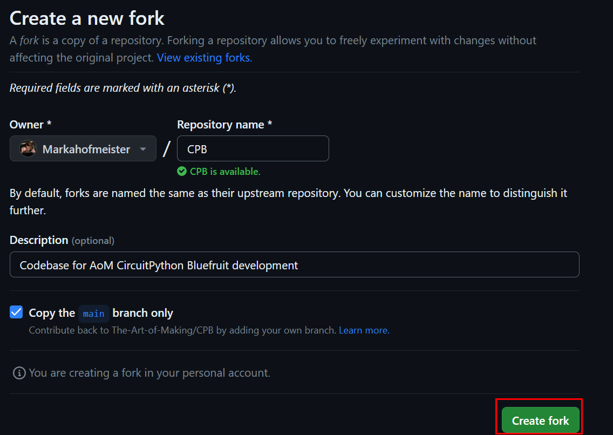

2. **Navigate to this Semester's Projects Folder**

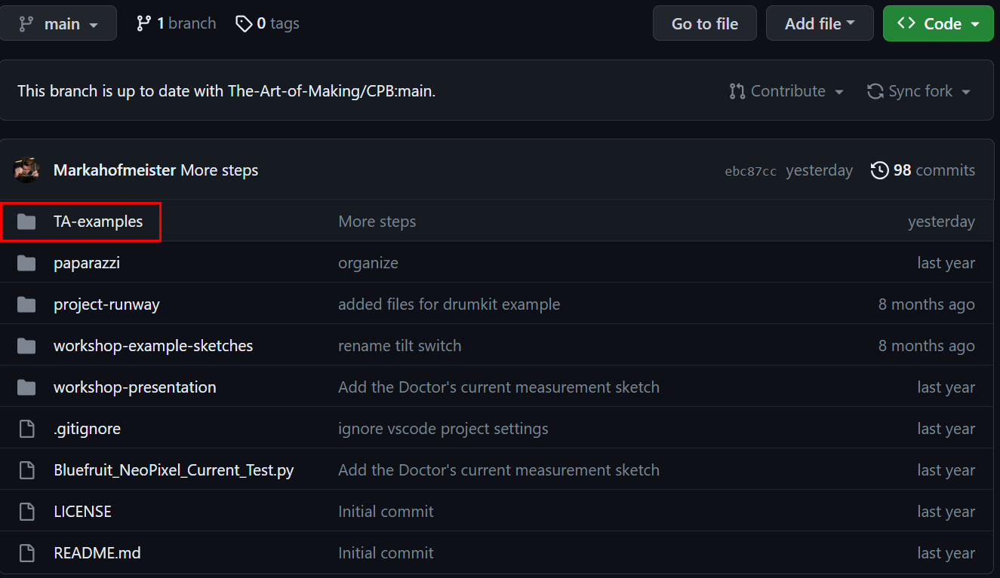

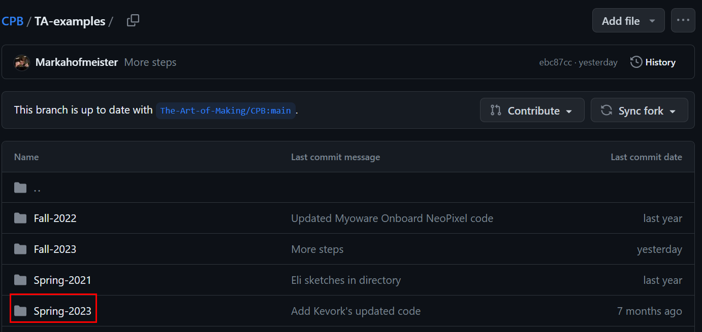

I'm using the Spring 2023 folder as an example. For Fall 2023, the directory path will be `TA-examples` --> `Fall-2023`

3. **Click on your Demo Project's Appropriate Directory**
   
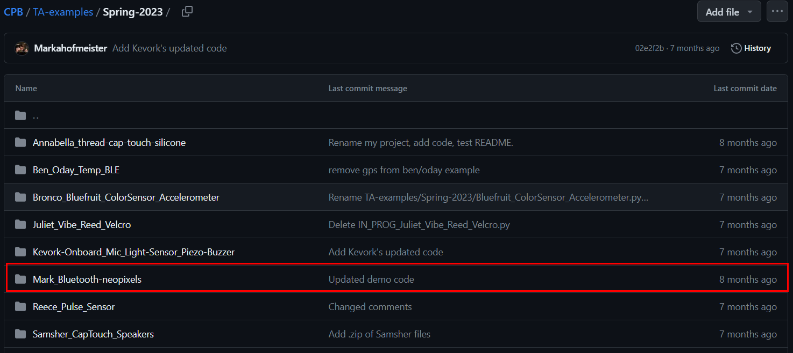

4. **Upload your Demo Project Code to the Appropriate Directory**

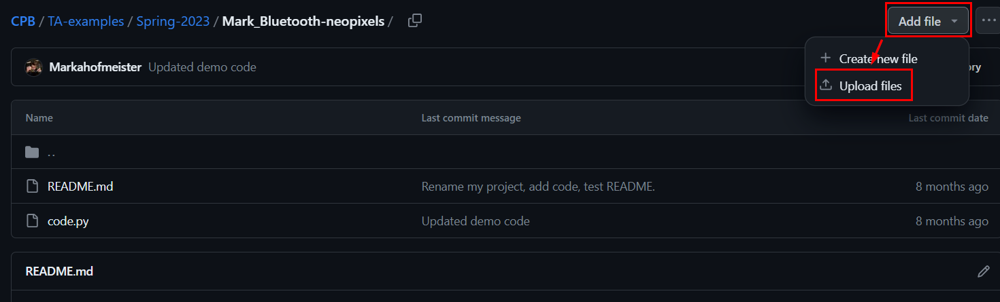

5. **Click into the .py File that you've just Uploaded and Click the "Raw" Button**

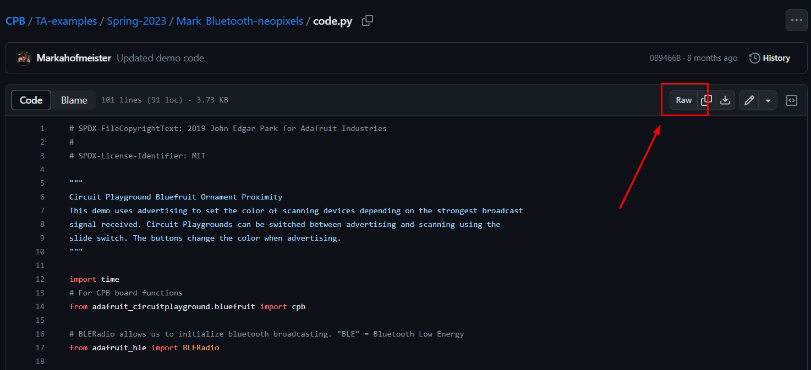

6. **Copy the Raw Code Link into the description of your YouTube video**

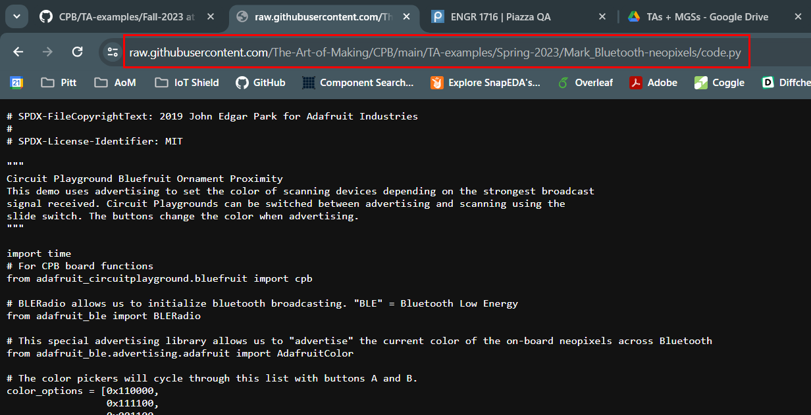

7. **Go back to your Project's Directory and Click the Edit Button on the README File"**

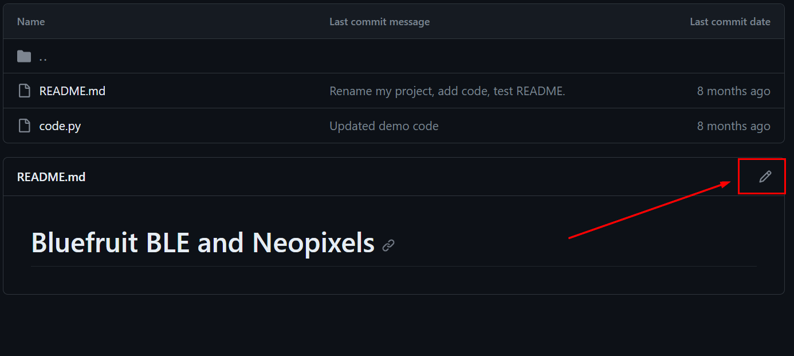

8. **Fill the README with your Project's Description and Click "Commit Changes"**

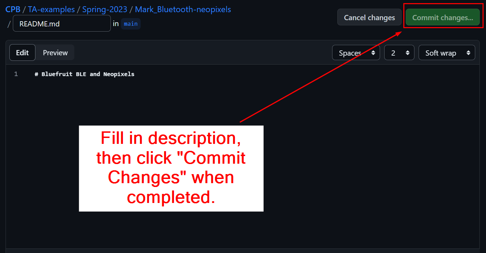

9. **Change the Commit Message if you Desire and Click "Commit Changes" to save your README Updates.**

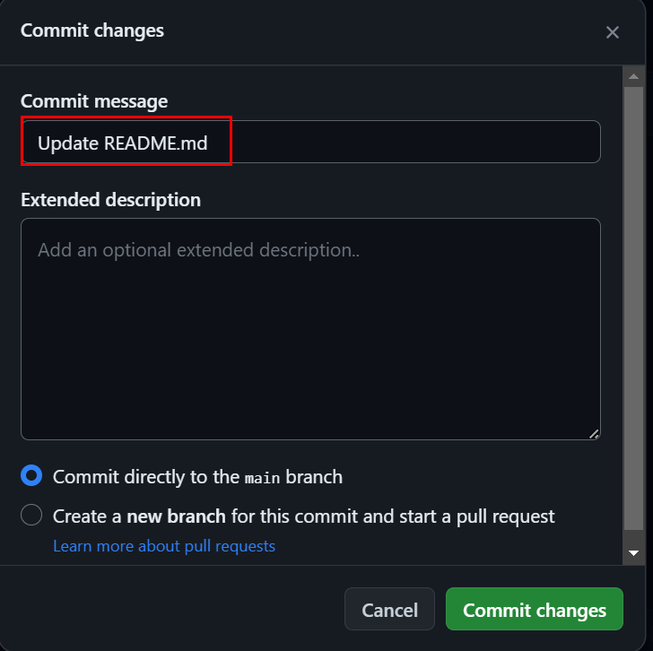

10. **Open a Pull Request by Using the Contribute Button.**

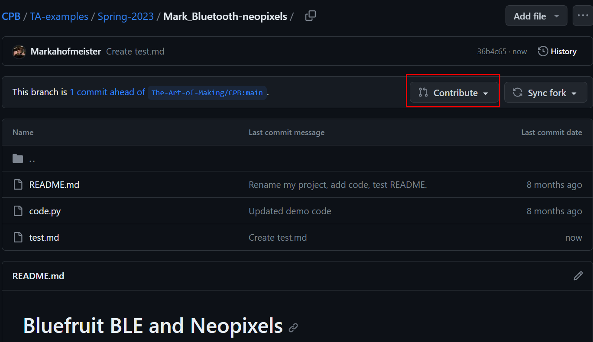
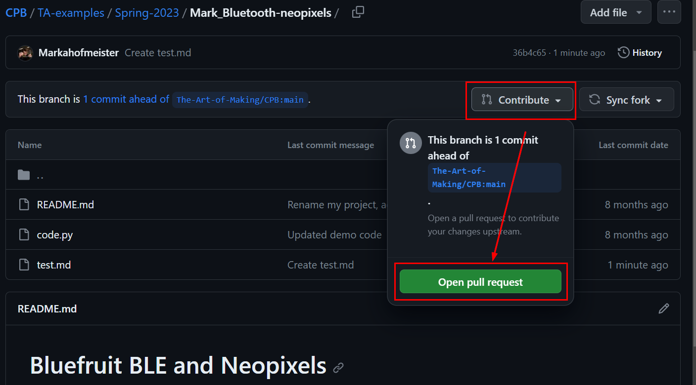
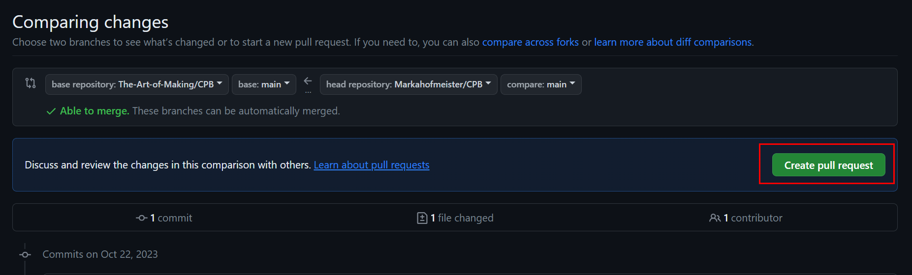
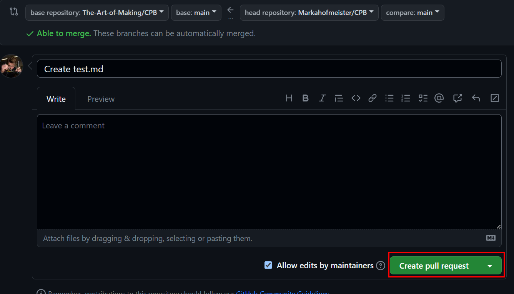

You're done - someone with write access to The Art of Making organization will then approve the pull request to be merged into the main repository. 

